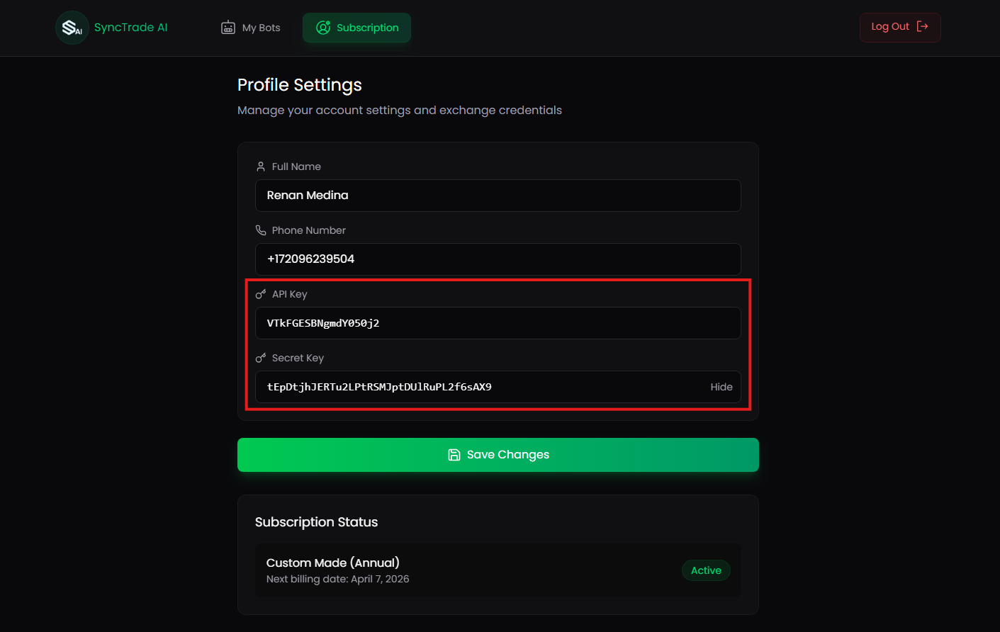

# 🔑 Set Your ApiKey and Secret

To enable your trading bots to interact with your Bybit account, you must first link your API credentials securely within the SyncTrade AI dashboard.

This is a **one-time setup** that allows our platform to execute trades, retrieve balances, and manage positions on your behalf.

---

## 📍 Step-by-Step Instructions

Upon your **first login**, follow these steps:
1. Navigate to the top menu and click on **`Subscription`**.
2. You will see two input fields:
   - **ApiKey**
   - **SecretKey**
3. Paste the respective keys that you’ve generated on your Bybit account.
4. Click **Save** to store your credentials securely.

> 🔒 *Your credentials are encrypted and securely stored. We never access or store your funds.*

---

## ❓Need Help Generating API Keys?

If you're not sure how to generate your API credentials on Bybit:

- Go to the **Integration Bybit** section in our docs.
- Open **[Generate ApiKey and Secret](/docs/Integration%20Bybit/generate-apikey.md)**.
- Follow the illustrated step-by-step guide.

> 💡 *Be sure to grant only the necessary permissions (Orders & Positions) and never enable withdrawal access on your API key.*

Once saved, your API will be linked, and you’ll be ready to launch your trading bots!

---
